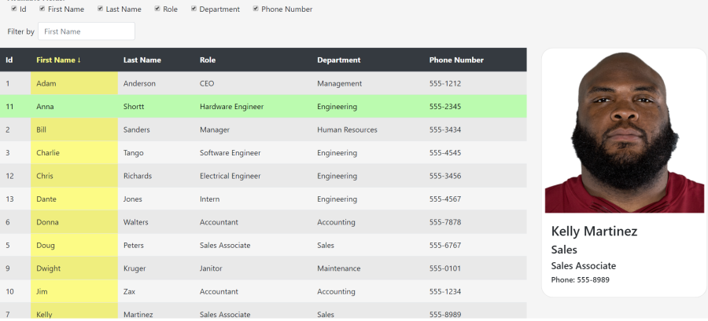

# React Employee Directory
An employee directory viewer using react.

This is an example employee directory applcation that uses react to show a list of employees and provides options for sorting and filtering the data.  Data comes from a js seed file.

## Features
### Adjust View
- Check/check fields to adjust the view columns 

### Sort View
- Click on the column Headings to Sort by that field. Click again to change the sort direction

### Filter View
- Enter in terms to filter the employee set. Filter is based on the active column. 
- Search list is automatically populated with all available options

### Other features
- View an Employee's image by clicking on the row
- Copy Employee data to clipboard by double clicking the row
- Save the data for employees in the current view to a JSON file.
- Add new columns to the seed file and the table will automatically adjust
- Mobile ready.

## Deployed Site
[Employee React Directory](https://kgeary.github.io/react-directory/)  
